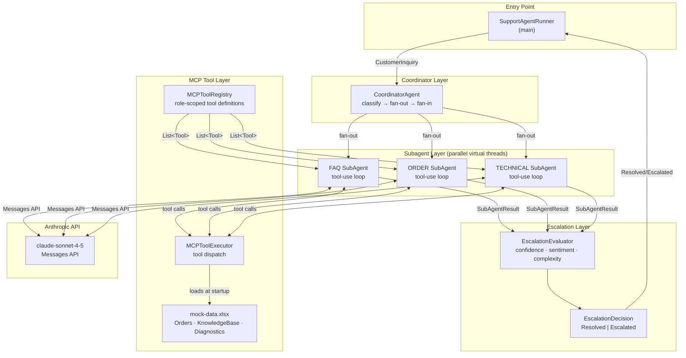
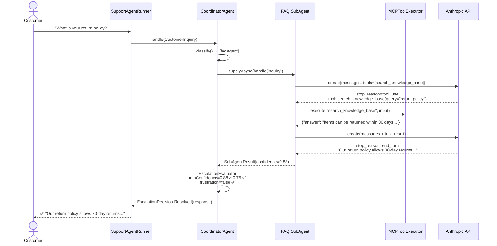
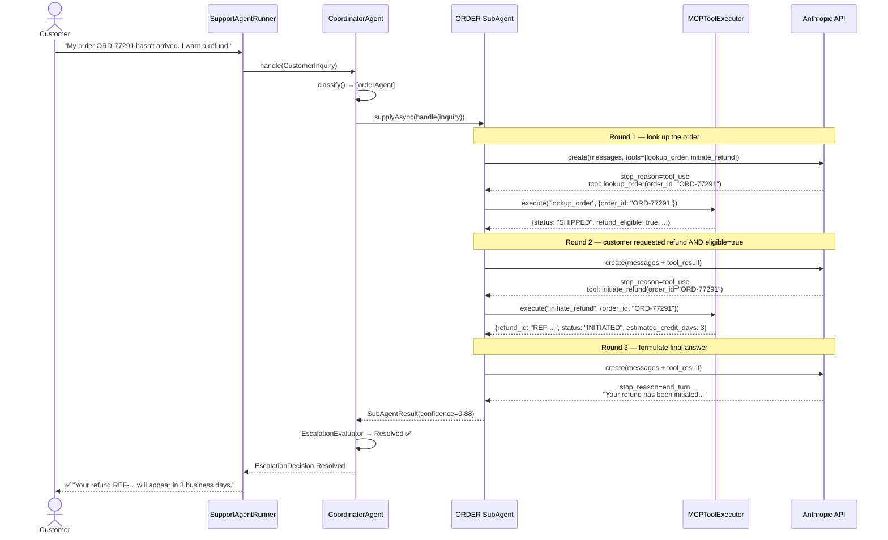
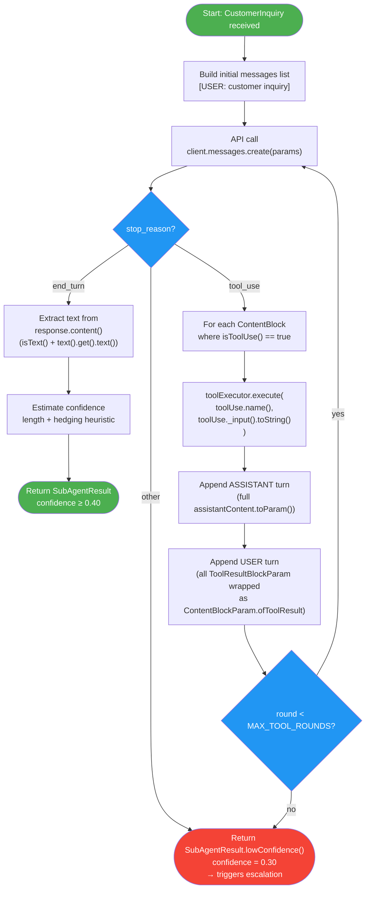
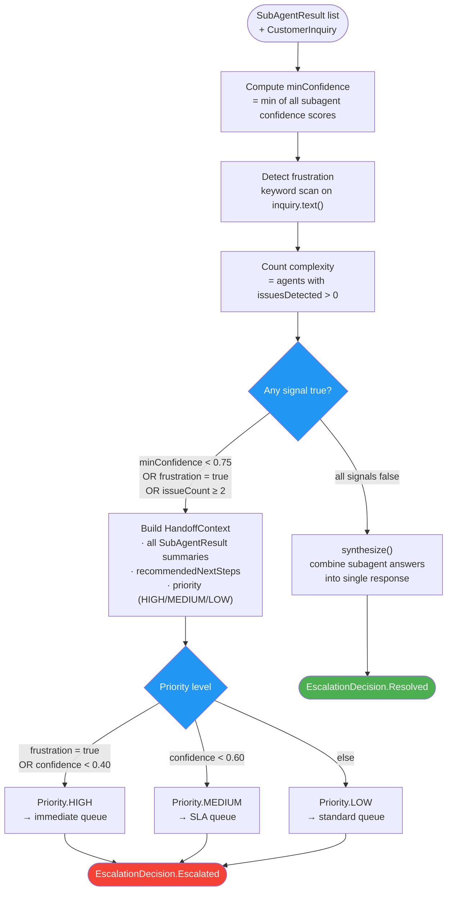
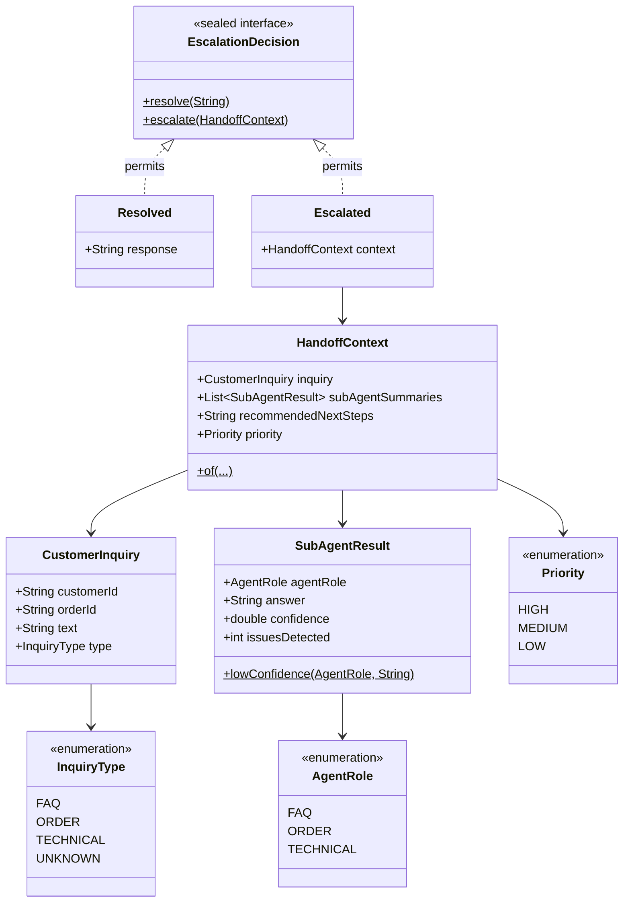
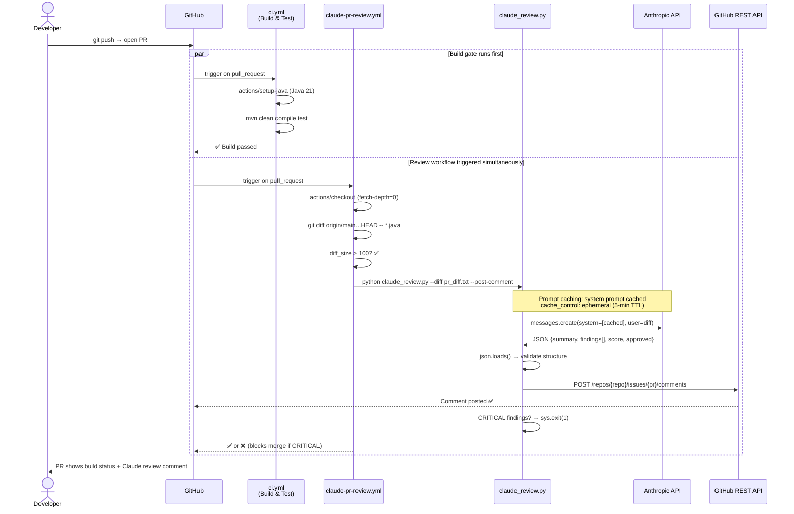
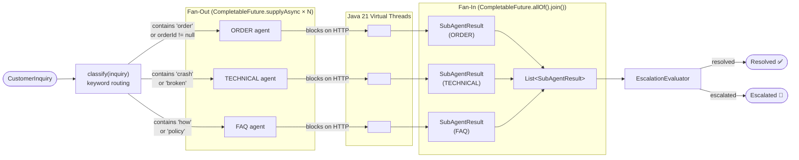
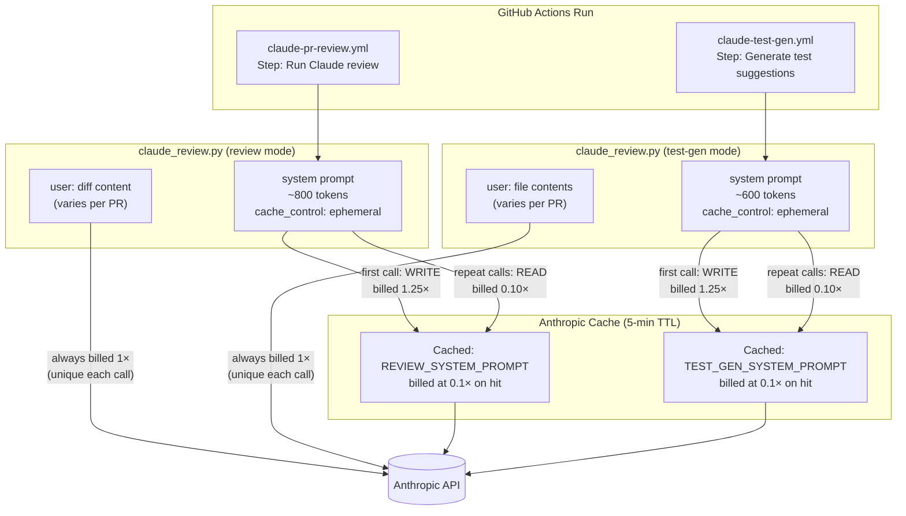

# Architecture Diagrams

All diagrams use [Mermaid](https://mermaid.js.org/) — rendered natively on GitHub,
GitLab, and in VS Code / IntelliJ with the Mermaid plugin.

---

## 1. System Overview (Component Diagram)

High-level view of all components and their dependencies.



---

## 2. Sequence Diagram — Scenario 1: Simple FAQ

One agent, one tool call, resolved automatically.



---

## 3. Sequence Diagram — Scenario 2: Order + Refund (Multi-Round Tool-Use Loop)

ORDER agent runs two tool calls in sequence before giving a final answer.



---

## 4. Sequence Diagram — Scenario 3: Parallel Agents + Escalation

Two agents run in parallel; frustration signal triggers escalation.

```mermaid
sequenceDiagram
    actor Customer
    participant Runner as SupportAgentRunner
    participant Coord as CoordinatorAgent
    participant ORDER as ORDER SubAgent
    participant TECH as TECHNICAL SubAgent
    participant Exec as MCPToolExecutor
    participant API as Anthropic API
    participant Human as Human Agent Queue

    Customer->>Runner: "This is UNACCEPTABLE! Order wrong AND app crashing!"
    Runner->>Coord: handle(CustomerInquiry)
    Coord->>Coord: classify() → [orderAgent, technicalAgent]

    Note over Coord,TECH: Fan-out: both agents launch simultaneously (virtual threads)
    par ORDER agent
        Coord->>ORDER: supplyAsync(handle)
        ORDER->>API: create(tools=[lookup_order, initiate_refund])
        API-->>ORDER: tool_use: lookup_order(ORD-55100)
        ORDER->>Exec: execute("lookup_order")
        Exec-->>ORDER: {status: DELIVERED, refund_eligible: false}
        ORDER->>API: create(+ tool_result)
        API-->>ORDER: end_turn — "Order delivered; refund not eligible"
        ORDER-->>Coord: SubAgentResult(confidence=0.75, issues=0)
    and TECHNICAL agent
        Coord->>TECH: supplyAsync(handle)
        TECH->>API: create(tools=[run_diagnostic, create_ticket])
        API-->>TECH: tool_use: run_diagnostic(user_id=CUST-003)
        TECH->>Exec: execute("run_diagnostic")
        Exec-->>TECH: {connectivity: FAIL, known_incidents: true}
        TECH->>API: create(+ tool_result)
        API-->>TECH: tool_use: create_ticket(priority=HIGH)
        TECH->>Exec: execute("create_ticket")
        Exec-->>TECH: {ticket_id: TKT-..., status: OPEN}
        TECH->>API: create(+ tool_result)
        API-->>TECH: end_turn — "Ticket TKT-... created"
        TECH-->>Coord: SubAgentResult(confidence=0.88, issues=0)
    end

    Note over Coord: Fan-in: allOf().join() — wait for both results

    Coord->>Coord: EscalationEvaluator<br/>"unacceptable" → frustration=true 🚨<br/>→ Priority.HIGH

    Coord-->>Runner: EscalationDecision.Escalated(HandoffContext)
    Runner-->>Human: 🚨 Priority=HIGH<br/>Summaries from both agents<br/>recommendedNextSteps
    Runner-->>Customer: (no automated reply — human takes over)
```

---

## 5. Flowchart — Tool-Use Loop State Machine

The exact states inside `SubAgent.handle()`.



---

## 6. Flowchart — Escalation Decision Logic

How `EscalationEvaluator` decides between Resolved and Escalated.



---

## 7. Class Diagram — Model Layer

Relationships between all domain objects.



---

## 8. Sequence Diagram — CI/CD Pipeline (Claude PR Review)

What happens when a developer opens a pull request.



---

## 9. Flowchart — Multi-Agent Fan-Out / Fan-In

How `CoordinatorAgent` orchestrates parallel execution.



---

## 10. Flowchart — Prompt Caching Strategy (CI Pipeline)

How prompt caching reduces token cost across multiple Claude calls in one pipeline run.


